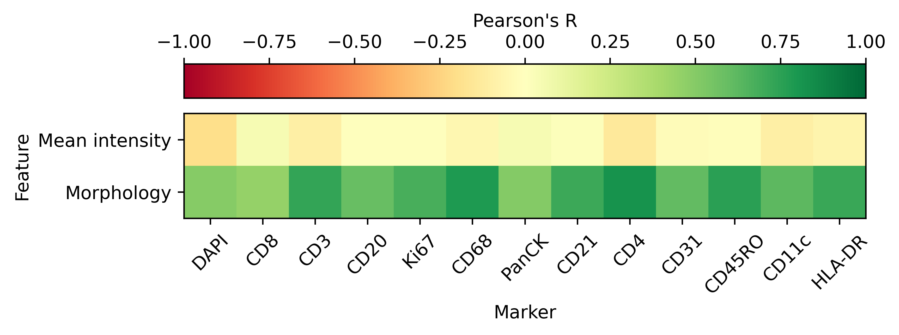

# morph
***Multiplex tissue imaging batch correction with morphological anchors***

Source data https://www.nature.com/articles/s41597-023-02108-z

Pytorch 2.7.0 environment on Rivanna

# Method overview
* Segment each cell and crop into individual images (1 marker)
* Normalize each cell by sum of intensities to convert cell to spatial probability distribution
* Fix cell rotation
* Use dimensionality reduction technique (VAE, OT, PCA, etc) on single-cell images
* Embed multiple batches into same feature space
* Use graph-based methods to identify "anchors" across samples
* Use some QC metric to score anchors by likelihood ?
* Use landmark normalization, with landmarks being anchor points along distribution
* viola

# Paper overview
***Figure 1***: Spatial distribution of normalized marker pixel intensity predicts mean pixel intensity
* ***1A***: conceptual graphic of normalizing intensity per cell
* ***1B***: Heatmap of marker prediction correlations
  
* ***1C***: Image feature correlations with mean intensity

***Figure 2***: morph uses morphological anchors to normalize marker expression across batches
* ***2A***: Method overview
* ***2B***: UMAP of morphological features versus mean intensity features
* ***2C***: morph validation with synthetic batches using various transformations 
* ***2D***: Small-scale application of method to 1 dataset with benchmarking (z-score, mxnorm, min-max)

***Figure 3***: morph performance on cross-modality data
* ***3A***: Comprehensive performance on many multiplex tissue imaging datasets
* ***3B***: Cross-modality application (IMC/IF, etc)
* ***3C***: Improved analysis (cell type assignemnt, silhouette score, etc)

# Useful references
* https://www.biorxiv.org/content/10.1101/2024.12.06.626879v2.full
* https://www.nature.com/articles/s42003-020-0828-1
* https://www.nature.com/articles/s42003-022-03368-y
* https://link.springer.com/article/10.1186/s13040-016-0088-2
* https://pmc.ncbi.nlm.nih.gov/articles/PMC9401552/
* https://www.cell.com/cell-reports-methods/fulltext/S2667-2375(21)00101-6
* https://www.pnas.org/doi/pdf/10.1073/pnas.1319779111
